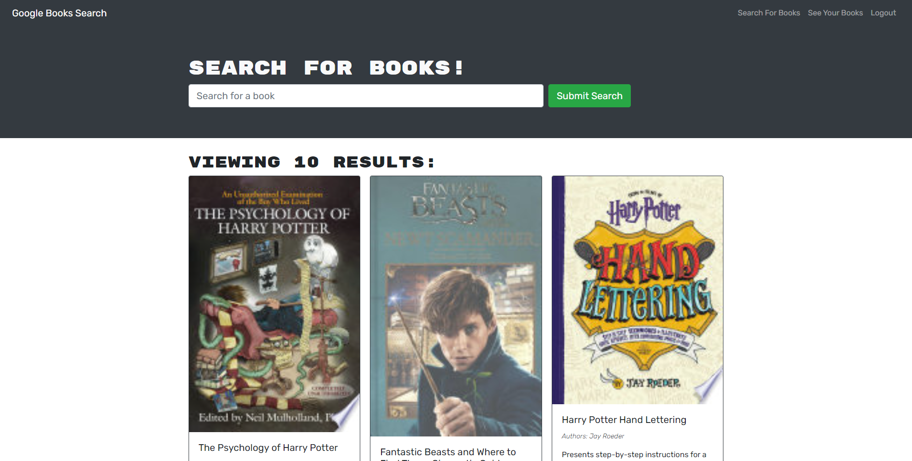

# MERN-BookSearch

## Description
This homework assignment uses Google Books API and allows a user to search and save books. This application uses React, MERN stack, MongoDB, and Node.js/Express.js.

## Table of Contents
* [Installation](#installation)
* [Usage](#usage)
* [License](#license)
* [Contribution](#contribution)
* [Test](#test)
* [Questions](#questions)

## Installation
In order to install this project, type "npm i" into your terminal to install the node packages. 

## Usage
N/A

## License
There is no license used for this project.

## Contribution
N/A

## Test
In order to test this project, type "npm run build" into your terminal. After, type "npm run develop" and the application should automatically render into your browser. There is a console log that links the GraphQL link for users to view. Once the user is on the site, the user can click the "login/sign up" button on the top right corner of the page and create an account. Once the user is signed in, the user can simply type in a book title that they wish to search for and the API will render all of the different books available according to the search. The search will show the user the book title, author, description, image, and so much more! From here, the user an click to "Save this Book!" and add it to their collection. If a user wishes to view their books that they saved, they can click the "See Your Books" tab on the top right corner and it will display all of the books the user has saved. If there is a book in the saved list that the user wishes to delete, the user can click the "Delete this Book!" button and the book will delete from the saved books page. 

## Questions
If you have any questions, please feel free to reach out to me at:
* Github: https://github.com/lydiakim10
* Email: lydiakim10@yahoo.com

## Heroku Site
https://ancient-sierra-09384.herokuapp.com/

## Screenshots

